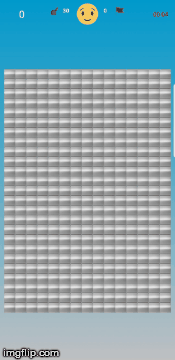
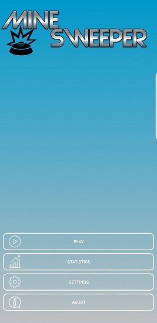
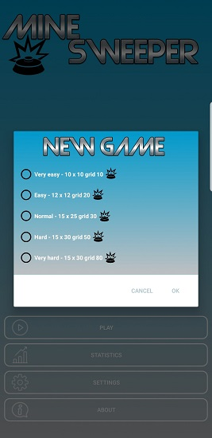
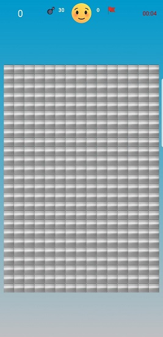
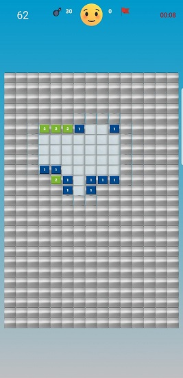
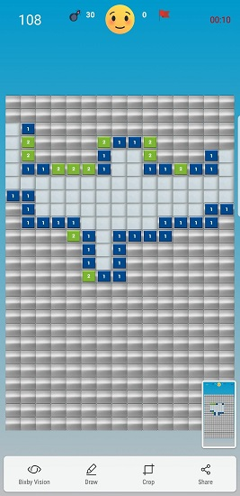
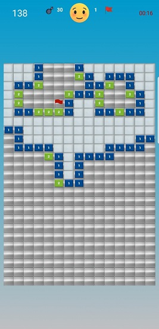
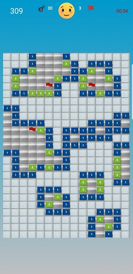
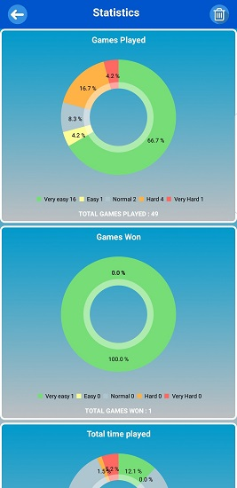

# MineSweeper

Minesweeper is a single-player puzzle video game. The objective of the game is to clear a rectangular board containing hidden "mines" or bombs without detonating any of them,with help from clues about the number of neighboring mines in each field.

The player is initially presented with a grid of undifferentiated squares. Some randomly selected squares, unknown to the player, are designated to contain mines. Typically, the size of the grid and the number of mines are set in advance by the user, either by entering the numbers or selecting from defined skill levels, depending on the implementations.

The game is played by revealing squares of the grid by clicking or otherwise indicating each square. If a square containing a mine is revealed, the player loses the game. If no mine is revealed, a digit is instead displayed in the square, indicating how many adjacent squares contain mines; if no mines are adjacent, the square becomes blank, and all adjacent squares will be recursively revealed.

The player uses this information to deduce the contents of other squares, and may either safely reveal each square or mark the square as containing a mine.

HOW TO PLAY

SINGLE CLICK a cell to reveal the cell.

LONG CLICK a cell to mark the cell as a potential mine.

LONG CLICK a marked cell to clear the flag.

Once all non mine cells are revealed, the player wins and the game is over.

Game behaviour in relation to vibration and sound feedback can be changed in settings.
